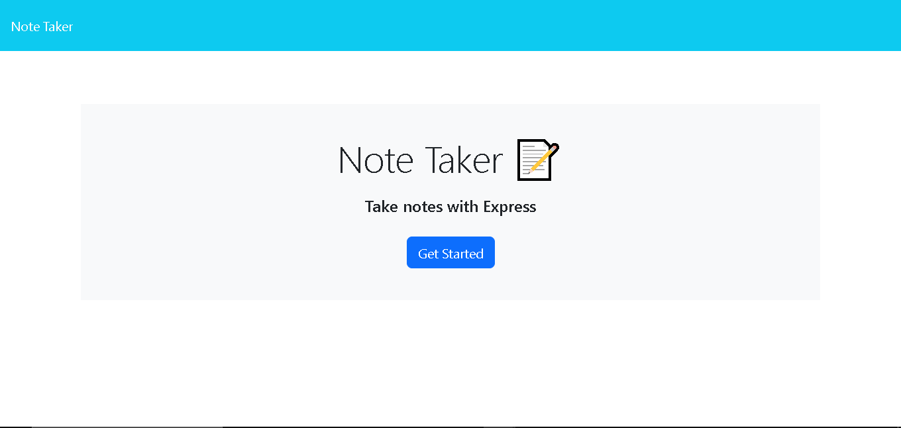
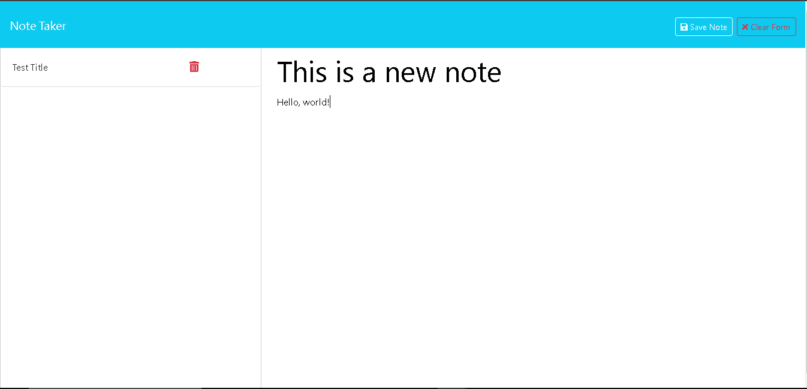

# Good Notes 📝
  
  ## Description
  Good Notes is a simple yet useful note taking app. Taking notes can be a great way to keep track of ideas. And, this app makes it simple to keep track of them by enabling the user to enter, save, and delete them. 
  ## Table of Contents

  1. [Installation](#Installation)
  2. [Usage](#Usage)
  3. [License](#License)
  4. [Questions](#Questions)

  ## Installaion
  No installation is necessary.  
  Simply visit [Good Notes](https://good-notes-13au.onrender.com/) on the web to get started.
  ## Usage
  

  Upon arriving at the landing page, click the  button located in the middle of the screen.  
  Enter the Note Title and Note Text in the text fields on the right.  

  
  
  The user can then click the  button in the upper-right to save into the notes list.  
  Or, the user can click the  button located next to the Save button to clear the form and start over.

  After saving a new note, the new note will appear in the notes list to the left. The user can then select a note to see its contents in the main text area.  
  
  Also, the user can delete a note by clicking the  icon for that note in the notes list.

  

  ## License
  This software uses the MIT License.
  ## Questions
  To see more projects or to contribute, please visit my GitHub profile at [JFleming963](https://github.com/JFleming963).
